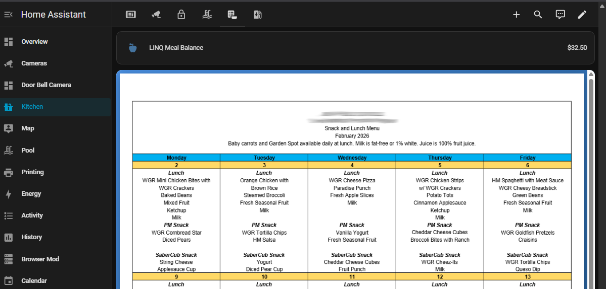
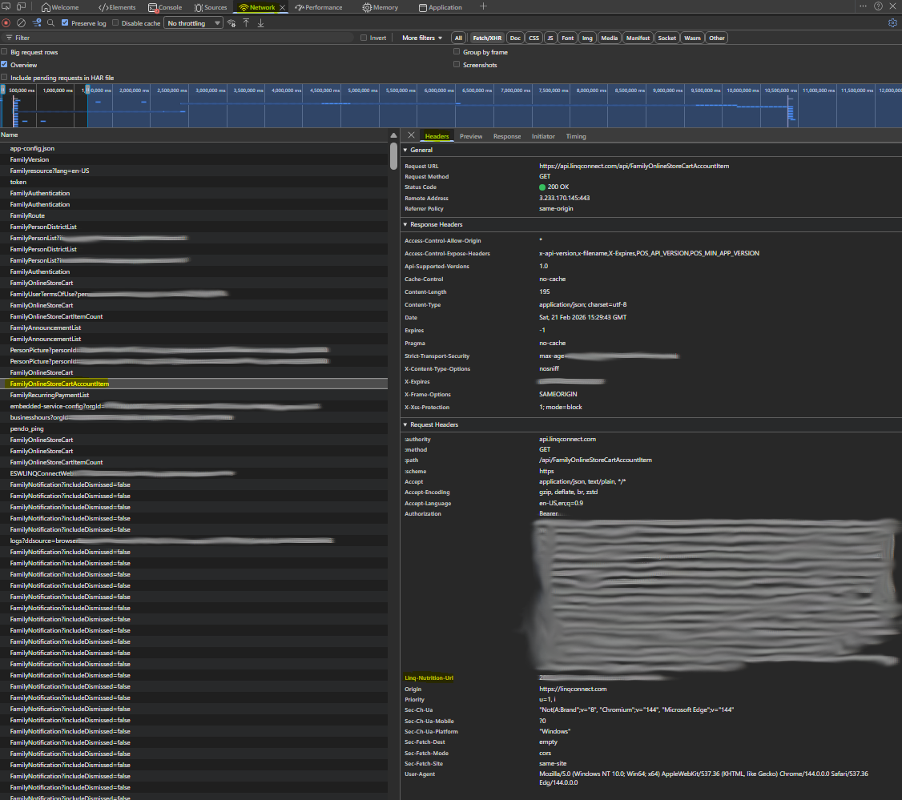
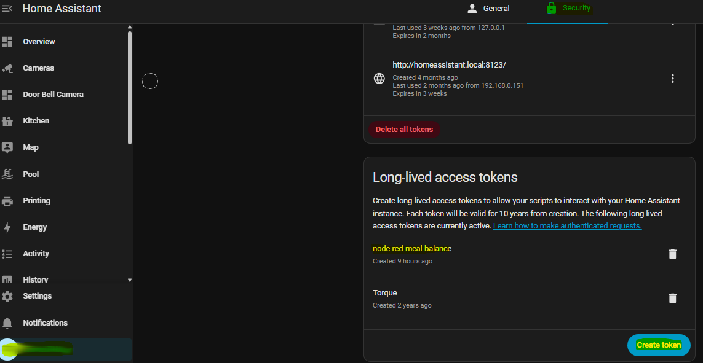
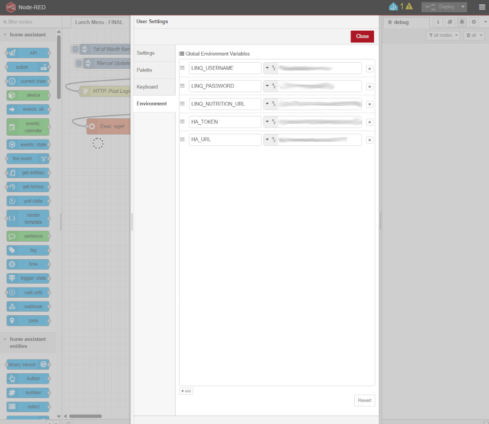
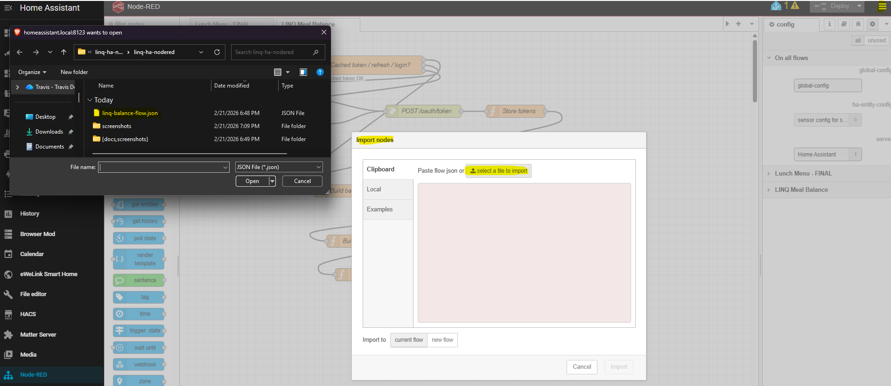
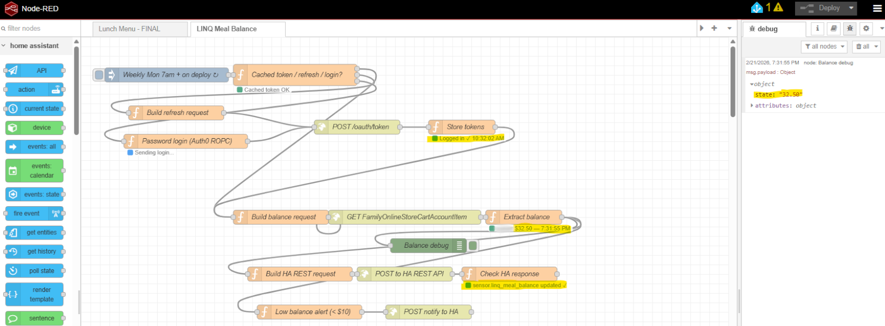
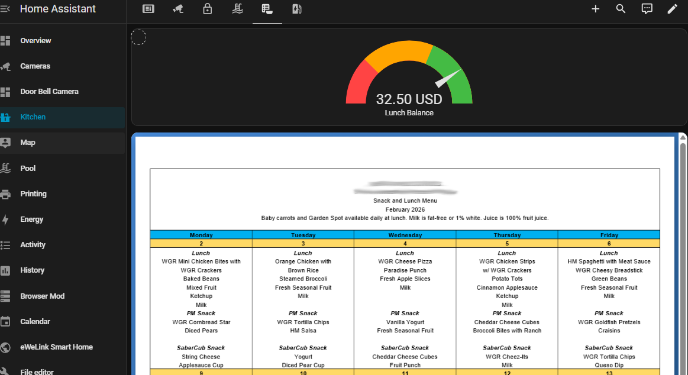

# LINQ Connect Meal Balance — Node-RED & Home Assistant Integration

Automatically fetch your student's meal balance from [LINQ Connect](https://linqconnect.com) each week and display it as a native sensor in Home Assistant, with optional low-balance push notifications.



---

## Features

- **Automatic weekly fetch** — runs every Monday at 7:00 AM (configurable)
- **Native HA sensor** — `sensor.linq_meal_balance` with USD unit, monetary device class, and full attributes
- **Smart token caching** — logs in once, reuses tokens; only re-authenticates when needed
- **Low-balance alert** — push notification when balance drops below $10 (configurable)
- **No custom integrations** — uses the built-in HA REST API; nothing to install in HA
- **Secure** — credentials stored only as Node-RED environment variables, never in the flow

---

## Prerequisites

- Home Assistant (any recent version)
- [Node-RED add-on](https://github.com/hassio-addons/addon-node-red) installed in HA
- A LINQ Connect parent account
- A web browser with DevTools (Chrome, Edge, or Firefox)

---

## Quick Start

### Step 1 — Find your school GUID (`LINQ_NUTRITION_URL`)

This is a unique identifier for your school district. You only need to find it once.

1. Log into [linqconnect.com](https://linqconnect.com)
2. Open DevTools: press `F12` (Windows/Linux) or `Cmd+Option+I` (Mac)
3. Click the **Network** tab → then **Fetch/XHR** in the filter bar
4. Navigate to the page where your student's balance is shown
5. Look for a request named `FamilyOnlineStoreCartAccountItem`
6. Click it → **Headers** → scroll to **Request Headers**
7. Copy the value of `linq-nutrition-url` — it looks like `xxxxxxxx-xxxx-xxxx-xxxx-xxxxxxxxxxxx`



> **Note:** This GUID identifies your school/district, not your account. All parents at the same school share the same value.

---

### Step 2 — Create a Home Assistant Long-Lived Access Token

1. In Home Assistant, click your **profile icon** (bottom-left of sidebar)
2. Scroll to **Security** → **Long-Lived Access Tokens** → **Create Token**
3. Name it `Node-RED LINQ` and click **OK**
4. **Copy the token immediately** — it is only shown once



---

### Step 3 — Set environment variables in Node-RED

In Node-RED: **hamburger menu → Settings → Environment** tab → add each variable:

| Variable | Description |
|---|---|
| `LINQ_USERNAME` | Your LINQ Connect login email |
| `LINQ_PASSWORD` | Your LINQ Connect password |
| `LINQ_NUTRITION_URL` | School GUID from Step 1 |
| `HA_TOKEN` | Long-Lived Access Token from Step 2 |
| `HA_URL` | Your HA URL, e.g. `http://homeassistant.local:8123` |



> After setting variables, click **Done** then **Deploy**.

---

### Step 4 — Import the flow

1. In Node-RED: **hamburger menu → Import**
2. Click **select a file to import** and choose `linq-balance-flow.json`
3. Click **Import**



---

### Step 5 — Deploy and verify

1. Click the red **Deploy** button (top-right)
2. The flow runs automatically 10 seconds after deploy
3. Within 30 seconds, check node status indicators:

| Node | Expected | Meaning |
|---|---|---|
| Store tokens | 🟢 Logged in ✓ | Auth0 accepted credentials |
| Extract balance | 🟢 $XX.XX — HH:MM AM | Balance retrieved |
| Check HA response | 🟢 sensor updated ✓ | HA sensor created/updated |



---

## Home Assistant Dashboard

### Entity Card (simple)

Add a card → **Entity** → search for `sensor.linq_meal_balance`.

### Gauge Card (visual)

```yaml
type: gauge
entity: sensor.linq_meal_balance
name: Lunch Balance
unit: USD
min: 0
max: 40
needle: true
segments:
  - from: 0
    color: "#FF4444"
  - from: 10
    color: "#FFA500"
  - from: 25
    color: "#44BB44"
```



---

## Sensor Details

**Entity ID:** `sensor.linq_meal_balance`

| Attribute | Value |
|---|---|
| `unit_of_measurement` | USD |
| `device_class` | monetary |
| `state_class` | measurement |
| `icon` | mdi:food-apple |
| `student_name` | Student's name from LINQ |
| `all_accounts` | JSON array of all accounts |
| `last_updated` | ISO timestamp of last fetch |

---

## Schedule

Default: every **Monday at 7:00 AM** + once on deploy.

To change: double-click the **inject** node and modify the cron expression.

```
0 7 * * 1    →  Monday 7:00 AM
0 7 * * 1-5  →  Weekdays 7:00 AM
0 8 * * 0    →  Sunday 8:00 AM
```

---

## Low Balance Notification

The flow fires a push notification **once** when the balance first drops below $10. It uses HA's `notify.notify` service (sends to all registered notification targets).

To target a specific phone, open the **Low balance alert** function node and change:
```
/api/services/notify/notify
```
to:
```
/api/services/notify/mobile_app_your_phone_name
```

Find your device name at: **HA → Settings → Devices & Services → Mobile App**.

---

## Troubleshooting

| Error | Solution |
|---|---|
| Token error 500: not configured with default connection | Wrong grant type — make sure you are using the latest flow version (v5+) |
| Token error 403: Invalid state / AnomalyDetected | Old PKCE-based flow — import the current `linq-balance-flow.json` instead |
| Token error 401: Unauthorized | Wrong LINQ credentials — check `LINQ_USERNAME` and `LINQ_PASSWORD` |
| `mfa_required` | MFA is enabled on your LINQ account — disable it at linqconnect.com (Profile → Security) |
| Missing LINQ_NUTRITION_URL | Environment variable not set — follow Step 1 |
| HA REST 401 | Invalid HA token — regenerate it (Step 2) and update `HA_TOKEN` |
| HA REST 404 | Wrong HA URL — check `HA_URL` includes port `:8123` and no trailing slash |
| Flow ran but no sensor in HA | Check the **Check HA response** node status for error details |

---

## How Authentication Works

LINQ Connect uses [Auth0](https://auth0.com) for authentication. This flow uses the **Resource Owner Password Credentials grant with realm** (`password-realm`) — a single direct API call to Auth0 that trades your credentials for tokens, without requiring a browser.

**Token strategy (3 tiers, in order):**

1. **Cached access token** — valid for 24 hrs; used directly with no network call
2. **Refresh token** — used to get a new access token without re-entering credentials
3. **Password login** — only when both tokens are absent or expired; reads from env vars

Your password is read from an environment variable at login time only. It is never written to disk, logged, or stored in the flow JSON.

---

## Technical Reference

**Auth0 token endpoint:**
```
POST https://accounts.linq.com/oauth/token
```

**Balance API:**
```
GET https://api.linqconnect.com/api/FamilyOnlineStoreCartAccountItem
Headers:
  Authorization: Bearer <access_token>
  linq-nutrition-url: <your-school-guid>
```

**HA sensor endpoint:**
```
POST http://<HA_URL>/api/states/sensor.linq_meal_balance
Headers:
  Authorization: Bearer <HA_TOKEN>
  Content-Type: application/json
```

---

## Limitations & Disclaimer

- This integration uses the LINQ Connect API **unofficially**. LINQ may change their API at any time without notice.
- The `password-realm` grant requires LINQ's Auth0 tenant to have this grant type enabled. It works as of February 2026.
- Users with **MFA enabled** on their LINQ account must disable it for automated login to work.
- This is **read-only** — it cannot add funds or modify meal settings.
- Refresh tokens may be invalidated if you change your LINQ password or if Auth0 detects unusual activity. The flow will automatically fall back to password login on the next run.

---

## Finding Your School's GUID (for others)

The `LINQ_NUTRITION_URL` GUID varies by school district. To find yours, follow Step 1 above.

If you'd like to share your district's GUID to help others, open a [Discussion](../../discussions) with your district name and GUID — community-contributed GUIDs help everyone skip Step 1.

---

## License

MIT License — see [LICENSE](LICENSE)

---

## Contributing

Pull requests welcome! If you find a bug or have a feature request, please open an [Issue](../../issues).

Suggested tags for the Node-RED Flows library: `home-assistant` `linq-connect` `meal-balance` `school` `auth0`
